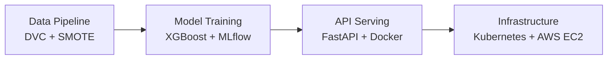

# Financial Fraud Detection Platform

A complete MLOps pipeline for detecting financial fraud in real-time. This project handles everything from dataset versioning and model training to serving predictions via Kubernetes. It also features a GenAI component that explains why a transaction was blocked using SHAP values and a local LLM.

## Project Architecture



## Key Technologies

- **Machine Learning**: Python, XGBoost, Scikit-learn, Imbalanced-learn (SMOTE)
- **MLOps & Tracking**: MLflow, DVC, Evidently
- **API & Serving**: FastAPI, Uvicorn, Docker
- **Infrastructure**: Kubernetes (Minikube/HPA), AWS EC2
- **CI/CD**: GitHub Actions, GitHub Container Registry (GHCR)
- **Monitoring**: Prometheus, Grafana
- **GenAI Explainability**: SHAP, Ollama (Local LLM)

## Overview

The goal of this project is to build a robust, scalable system to detect fraudulent transactions using the PaySim synthetic dataset (6.3M records). Since financial datasets are highly imbalanced (0.13% fraud rate), the pipeline uses SMOTE for oversampling and prioritizes precision-recall tradeoffs over raw accuracy.

### Core Features

1. **Automated Training Pipeline**: Uses DVC for data versioning. The preprocessing script cleans the data and handles class imbalance, while the training script trains an XGBoost model and logs all metrics and artifacts directly to MLflow.
2. **Production-Ready API**: A FastAPI application serves the model. It exposes `/predict` for real-time inference, `/health` for Kubernetes probes, and `/metrics` for Prometheus scraping.
3. **GenAI Explainability**: When a transaction is blocked, the `/explain` endpoint uses SHAP tree explainers to determine the driving features, and passes them to a locally-hosted LLM (via Ollama) to generate a human-readable investigation report for compliance teams.
4. **Scalable Deployment**: The application is containerized using Docker. A GitHub Actions CI/CD pipeline automatically lints, tests, and builds the image, pushing it to GHCR. The API is deployed to Kubernetes (Minikube) with a Horizontal Pod Autoscaler (HPA) to handle traffic spikes.
5. **Observability**: Prometheus scrapes custom business metrics (e.g., fraud block rate, prediction latency) from the API, which are visualized in real-time on a Grafana dashboard.

## Cloud & Production Strategy

While this project is designed to run locally using Minikube for development and testing, it is fully cloud-ready. 
The production deployment strategy involves running the Docker containers on an **AWS EC2** instance, utilizing the pre-built images from the GitHub Container Registry. The CI/CD pipeline ensures that any code pushed to the `main` branch is automatically tested and built for cloud deployment.

## Local Development Setup

To run this project locally on your machine:

```bash
# 1. Clone the repository
git clone https://github.com/saksham2410del/mlops-fraud-detection.git
cd mlops-fraud-detection

# 2. Set up the virtual environment
python -m venv .venv
source .venv/bin/activate  # On Windows use: .venv\Scripts\activate
pip install -r requirements.txt

# 3. Train the model and start the API
python src/preprocess.py
python src/train.py
uvicorn src.predict:app --reload
```

You can now test the API by navigating to `http://localhost:8000/docs`.

### Running with Docker Compose

To spin up the entire stack (API, MLflow, Prometheus, Grafana) locally:

```bash
docker-compose up --build
```
- **API (Swagger UI)**: `http://localhost:8000/docs`
- **MLflow Tracking**: `http://localhost:5000`
- **Grafana Dashboards**: `http://localhost:3000` (admin/admin)

## License

MIT License. See `LICENSE` for details.
